# Architecture

Modular design for an agentic product development harness. The architecture is **modular by subsystem** (product system, SCM/PR system, runner, agent provider, preview provider), but it is **not provider-agnostic yet**. Components are defined so the harness can run manually in Cursor while later phases add automation without rewriting the model — but in V0.2 the only implemented agent provider is Cursor. Runner phases import [`src/agents/`](src/agents/) for agent lifecycle operations; the Cursor adapter delegates to [`src/cursor/`](src/cursor/) for SDK-specific behavior.

## Configuration and portability posture

V0.2 is **Cursor-first**. Key assumptions:

- **Runner phases import `src/agents/` for agent lifecycle operations.** The internal provider seam exists (`src/agents/cursor-provider.ts`); Cursor SDK calls remain in `src/cursor/`. No second adapter is implemented.
- **`agentProvider` config makes Cursor explicit** (`id: "cursor"` only today). Model resolution prefers `agentProvider.model.id` and falls back to `defaultModel.id`.
- **GitHub and Linear are explicit V0.2 assumptions** — GitHub is the SCM/PR provider and cloud runner (GitHub Actions), and Linear is the product/control system.
- **Vercel is the only implemented preview provider** when preview capture is enabled; other repos use `previewProvider: "none"`.
- The harness does **not** claim Claude Code, Codex, VS Code local agents, GitLab, or Bitbucket support.

Details: [`docs/provider-portability.md`](docs/provider-portability.md) and [`docs/decisions/0004-agent-provider-boundary.md`](docs/decisions/0004-agent-provider-boundary.md).

### Setup core

**Status:** **Implemented** — Shared local setup services in [`src/setup/`](src/setup/) power `harness:operator:init` and the local Product Development Harness GUI Settings / Configure screen (`npm run harness:gui`).

**Purpose:** Generate and write local operator config (`.env.local`, `.harness/config.local.json`), classify setup actions by permission scope, produce manual GitHub Actions / target-repo instructions, and summarize doctor/model settings without changing runtime harness phase behavior.

**Inputs:** Structured setup state, committed example templates, operator-provided target repo mapping.

**Outputs:** Dry-run previews, confirmation-gated local file writes via GUI (`preview-local-files` / `apply-local-files` API routes), confirmation-gated remote harness secret writes and target workflow branch/PR installs via GUI (`preview-harness-secrets` / `apply-harness-secrets` / `preview-target-workflow` / `apply-target-workflow` API routes), CLI scaffold apply, copy-paste setup instructions. Linear writes remain deferred.

## Pipeline overview

```mermaid
flowchart LR
  issueIntake[IssueIntake] --> taskBootstrap[TaskBootstrap]
  taskBootstrap --> repoBootstrap[RepoContextBootstrap]
  repoBootstrap --> implPlan[ImplementationPlanning]
  implPlan --> execution[Execution]
  execution --> validation[ValidationEvals]
  validation --> readiness[ReadinessReport]
  readiness --> humanGate[HumanApprovalGates]
  humanGate --> futureAuto[FutureAutomationLayer]
```



Planning is **optional** in the target Linear workflow. Low-risk issues may bypass planning and go directly from intake to execution. See [`docs/architecture/linear-automation-state-machine.md`](docs/architecture/linear-automation-state-machine.md).

## Components

### Issue intake

**Purpose:** Capture product intent in a structured, reviewable issue before any code is written.

**Status:** **Implemented** — Canonical ChatGPT prompt at [`prompts/issue-intake-chatgpt.md`](prompts/issue-intake-chatgpt.md) for PM intake; [`.agents/skills/issue-intake/SKILL.md`](.agents/skills/issue-intake/SKILL.md) for Cursor drafting; [`templates/linear-issue.md`](templates/linear-issue.md) aligned to parser contract; `harness validate-issue` for read-only validation with route-specific `--intended-phase`. Deferred Custom GPT package at [`gpt/issue-intake/`](gpt/issue-intake/). Skill system: [`docs/skills/skill-architecture.md`](docs/skills/skill-architecture.md).

**Inputs:** Problem statement, user context, acceptance criteria, out-of-scope boundaries.

**Outputs:** A single issue artifact that an implementation plan or direct build can reference. Routing is the **Linear status field** (Ready for Planning, Ready for Build), not a description section.

**Labels (operational):** `requires-plan` — should go through planning; `skip-plan` — may go directly to Ready for Build. Runner does not read labels today.

---

### Task bootstrap

**Purpose:** Translate an approved issue into an executable unit of work with clear scope and success criteria.

**v0.1:** Manual. PM or agent confirms issue is ready, selects target repo, and defines eval hints.

**Inputs:** Approved issue.

**Outputs:** Bootstrap record: target repo, branch intent, eval criteria references.

---

### Repo / context bootstrap

**Purpose:** Give the execution agent enough repository context to work narrowly without touching unrelated code.

**v0.1:** Manual. Open target repo in Cursor; point agent at relevant `AGENTS.md`, architecture docs, and issue/plan files. MCP tools are **optional** context providers—not assumptions.

**Inputs:** Target repo path, issue, plan draft (if planning ran).

**Outputs:** Scoped Cursor session with explicit out-of-scope paths.

---

### Implementation planning

**Purpose:** Produce a human-reviewable plan before code changes when scope or risk warrants it.

**v0.1:** Manual. Use [`templates/implementation-plan.md`](templates/implementation-plan.md). Agent may draft; human approves.

**Planned:** Planning Agent posts durable plan comment in Linear, then moves issue to Ready for Build.

**Inputs:** Issue, repo context.

**Outputs:** Plan listing approach, files, risks, validation steps, rollback—stored as a Linear comment (durable), not session memory.

**Optional:** Small, low-risk, well-scoped issues may skip this step per planning policy in the state machine doc.

---

### Execution

**Purpose:** Implement scoped changes via AI-assisted coding in a bounded environment.

**v0.1:** **Cursor** (local agent). No cloud agents, no unattended runs.

**Planned:** Implementation Agent triggered from Linear **Ready for Build** via router automation.

**Implemented (Milestone 3):** SDK implementation runner — Cursor cloud agent, branch + PR, Linear transition to **PR Open**.

**Implemented (Milestone 4):** SDK handoff runner — GitHub PR inspect, Vercel preview capture, PM handoff comment, Linear transition to **PM Review**. See [`docs/milestones/m4-handoff-phase.md`](docs/milestones/m4-handoff-phase.md).

**Inputs:** Linear issue; plan comment if `requires-plan`; otherwise issue body and acceptance criteria.

**Outputs:** Code/doc changes in a feature branch; PR opened; no merge without human gate.

---

### Handoff / PM review prep

**Purpose:** Bridge implementation output to product review by inspecting the PR, capturing preview URLs, and posting a durable handoff comment.

**Implemented (Milestone 4):** SDK handoff runner from Linear **PR Open** — reads implementation marker, inspects GitHub PR (`GITHUB_TOKEN` required), polls for Vercel preview, posts handoff comment, transitions to **PM Review**.

**Implemented (Milestone 5):** SDK revision runner — PM feedback from Linear, Cursor cloud agent on existing PR branch, revision comment, transition back to **PM Review**. See [`docs/milestones/m5-revision-phase.md`](docs/milestones/m5-revision-phase.md).

**Implemented (Milestone 6):** SDK merge runner — squash merge from **Ready to Merge**, deployment capture when merging to production branch, completion comment, transition to **Merged to Dev** (integration `baseBranch`) or **Merged / Deployed** (when `baseBranch === productionBranch`). See [`docs/milestones/m6-merge-phase.md`](docs/milestones/m6-merge-phase.md).

**Inputs:** Linear issue in PM Review with handoff marker; latest implementation marker with `pr_url`.

**Outputs:** PM handoff comment; preview URL when found; manifest and artifact bundle for review.

---

### Revision loop

**Purpose:** Apply PM feedback to an existing open PR and return the issue to PM Review.

**Implemented (Milestone 5):** SDK revision runner from **Needs Revision** — reads handoff marker + PM feedback, updates existing PR branch, posts revision comment.

**Inputs:** Linear issue in Needs Revision; handoff marker; PM feedback comment after handoff.

**Outputs:** Revision comment; updated PR on same branch; transition to PM Review.

---

### Merge / deployment completion

**Purpose:** Squash-merge an accepted PR and record production deployment evidence after PM approval.

**Implemented (Milestone 6):** SDK merge runner from **Ready to Merge** — reads revision or handoff marker, verifies PR base branch and checks, squash merges into configured `baseBranch`, captures production deployment URL only when merging to `productionBranch`, posts completion comment, transitions to integration or production success status.

**Implemented integration repair:** If a PR becomes `behind` or `dirty` while waiting in the repo/base merge queue, merge enters an integration repair sub-mode while the issue remains **Merging**. The runner first calls GitHub update-branch to merge the latest base into the PR branch. If GitHub cannot repair the branch automatically, a Composer 2.5 Cursor cloud repair agent starts from the PR branch, fetches the latest base, runs a local base-into-head merge, resolves conflicts, commits, validates, pushes the PR branch, and returns directly to merge if checks pass. Repair never promotes production and never returns the issue to PM Review solely because the PR branch changed.

**Branch strategy:** `repos[].baseBranch` is the integration branch (e.g. target-app `dev`); `productionBranch` remains `main`. After manual `dev → main` promotion, run **`harness:sync-production`** (CLI or harness GHA via `production_promoted` dispatch) to move Linear issues from **Merged to Dev** to **Merged / Deployed** when GitHub proves the merge commit is reachable on `productionBranch`. See [`docs/target-repo-branch-setup.md`](docs/target-repo-branch-setup.md) and [`docs/production-sync-automation.md`](docs/production-sync-automation.md).

**Concurrency (auto-runner):** The gate job resolves routing (`harness:resolve-route`); downstream jobs enforce concurrency. Non-merge phases use per-issue groups (`harness-{issueKey}`, cancel in progress). Merge runs queue on `harness-merge-{repoConfigId}-{baseBranch}` (`cancel-in-progress: false`, `queue: max`) so only one merge or integration repair into the same integration branch runs at a time, with up to 100 pending merge jobs preserved by GitHub Actions. Production sync remains serialized per repo config id.

**Inputs:** Linear issue in Ready to Merge; handoff or revision marker with `pr_url`; PM manually moved issue from PM Review.

**Outputs:** Squash-merged PR; merge completion comment; deployment URL or warning.

---

### Validation / evals

**Purpose:** Check output against explicit criteria—not vibes.

**v0.1:** Manual rubrics. Use [`templates/eval-scorecard.md`](templates/eval-scorecard.md) and [`evals/README.md`](evals/README.md). Later phases may add automated tests.

**Inputs:** Changed artifacts, acceptance criteria from issue.

**Outputs:** Scorecard with pass / partial / fail / N-A per criterion plus evidence.

---

### Readiness report

**Purpose:** Summarize whether a PR is ready for human product and engineering review.

**v0.1:** Manual. Use [`templates/pr-readiness-report.md`](templates/pr-readiness-report.md).

**Inputs:** Scorecard, diff summary, validation notes.

**Outputs:** Reviewer-facing readiness doc with open questions flagged.

---

### Human approval gates

**Purpose:** Ensure PM and engineering judgment remain in the loop via **Linear/status gates** — not bypassed by automation.

**V0.2:** Automation respects allowlisted Linear statuses. Merge runs only when the issue is **Ready to Merge** (PM moved it from PM Review). Planning, implementation, handoff, and revision phases each require the matching Linear status. **GitHub required review is 0** in solo-maintainer mode — see [`docs/security.md`](docs/security.md).

**Note:** `Plan Review` is **not** part of the default active workflow. If the status exists in Linear, it is deprecated/reserved—not routed by automations.

**Inputs:** Readiness report, preview URL (when available).

**Outputs:** Approved or rejected with feedback; feedback may spawn revision loop (Needs Revision → Revising → PM Review).

---

### Future automation layer

**Purpose:** Encode repeated manual steps only after they are validated (skills, scripts, CI, Linear sync, cloud agents).

**Implemented (Milestone 8):** Event-driven auto-runner — Vercel webhook bridge verifies Linear signatures, filters to dispatch allowlist statuses, and triggers GitHub Actions via `repository_dispatch`. See [`docs/milestones/m8-linear-watcher.md`](docs/milestones/m8-linear-watcher.md).

**Implemented (skills):** Canonical operator-invoked and runner/agent phase skills — `issue-intake`, `code-health-audit`, `architecture-evolution-audit`, `planner`, and `implementation` at [`.agents/skills/`](.agents/skills/). See [`docs/skills/skill-architecture.md`](docs/skills/skill-architecture.md).

**Still deferred:** Additional audit skills (`security-audit`, `performance-cost-audit`), skill registry/package manager, skill manifests, provider/client adapters, and runner-skill prompt integration. SDK runners continue to use [`src/prompts/`](src/prompts/) today.

**State machine:** [`docs/architecture/linear-automation-state-machine.md`](docs/architecture/linear-automation-state-machine.md)

**ADR:** [`docs/decisions/0003-automation-state-machine-and-auto-model-policy.md`](docs/decisions/0003-automation-state-machine-and-auto-model-policy.md)

---

### Linear watcher / auto-runner

**Purpose:** Start harness runs automatically when Linear issue status changes to an actionable trigger — without manual CLI invocation.

**Implemented (Milestone 8):**
- Vercel endpoint [`api/linear-webhook.ts`](../api/linear-webhook.ts)
- GitHub Actions workflow [`.github/workflows/harness-auto-runner.yml`](../.github/workflows/harness-auto-runner.yml)
- Dispatch allowlist: Ready for Planning, Ready for Build, PR Open, Needs Revision, Ready to Merge
- `workflow_dispatch` fallback for manual cloud runs

**Flow:**

```text
Linear webhook → verify signature → filter status → repository_dispatch → GHA → harness --phase auto
```

**Inputs:** Linear Issue webhook POST with status change to allowlisted status.

**Outputs:** GitHub Actions run; harness artifacts under `runs/<issueKey>/<run-id>/`.

Setup: [`docs/linear-watcher-setup.md`](docs/linear-watcher-setup.md)

---

## Linear automation

SDK runners (M1–M6) and the M8 event-driven watcher handle status-triggered harness phases. Native Cursor ↔ Linear assignment was smoke-tested once; the primary automation path is now **webhook → GitHub Actions**.

### Auto-run trigger statuses (M8 dispatch allowlist)

| Status | Harness phase |
|--------|---------------|
| Ready for Planning | planning |
| Ready for Build | implementation |
| PR Open | handoff |
| Needs Revision | revision |
| Ready to Merge | merge |

Transitional statuses (Planning, Building, PM Review, Merging, Merged / Deployed) are filtered at the webhook bridge with `ignored_status`.

### Default status flow

```text
Backlog → Ready for Planning → Planning → Ready for Build → Building
  → PR Open → PM Review → Engineering Review → Merged / Deployed
```

**Bypass (optional planning):** Backlog → Ready for Build → Building → …

**Revision loop:** PM Review → Needs Revision → Revising → PM Review

**Exceptions:** Blocked, Canceled, Duplicate — automations exit without action.

### Router-first design

The first automation inspects status and labels, then:

| Status | Flow |
|--------|------|
| Ready for Planning | Planning Agent |
| Ready for Build | Implementation Agent |
| PR Open | Handoff runner (M4) |
| Needs Revision | Revision runner (M5) |
| Ready to Merge | Merge runner (M6) |
| Other | Exit with no changes |

### Agent roles (planned)

| Role | Trigger | Primary durable output |
|------|---------|------------------------|
| Router Agent | Status change | Route or exit |
| Planning Agent | Ready for Planning | Plan comment in Linear |
| Implementation Agent | Ready for Build | Branch, PR, Linear comment |
| Revision Agent | Needs Revision | Commits, revision comment |
| Merge/Deployment Reporter | Ready to Merge | Final links comment |

Full role contracts: [`docs/architecture/linear-automation-state-machine.md`](docs/architecture/linear-automation-state-machine.md).

---

## Cursor model policy

Every Cursor Cloud agent launched by this harness (planning, implementation,
revision, and any future phase) uses **standard / basic Composer 2.5**.

- **Fast and Max modes are intentionally avoided** to control Cursor usage cost.
  The harness must never request the Fast variant, Max mode, or high/max
  reasoning.
- Model selection is **centralized** in [`src/cursor/model.ts`](src/cursor/model.ts).
  `Cursor.models.list()` reports that `composer-2.5`'s **default variant is
  `fast: true`**, so omitting model params makes the cloud server launch the Fast
  variant. To prevent this, the harness pins `id: "composer-2.5"` with
  `params: [{ id: "fast", value: "false" }]`, forcing standard Composer 2.5. The
  model exposes no `max_mode`/reasoning parameter, so no Max/high-reasoning
  variant can be (or is) requested.
- Changing model or mode must be a **deliberate config/code change** (via
  `defaultModel` in `harness.config.json` or `src/cursor/model.ts`) — never an
  accidental default.
- **Preferred future policy** is `Auto` if/when Cursor Automations support it as
  a model setting (see ADR 0003); until then, standard Composer 2.5 is the only
  allowed setting.
- Reports should mention the model setting used when relevant.

---

## Durable context principle

| Principle | Detail |
|-----------|--------|
| Durable state required | Linear comments, GitHub PR/commits, branch, Vercel preview URLs |
| Session reuse optional | Happy-path optimization when Cursor supports it |
| Fresh agent recovery | New agent must reconstruct context from durable artifacts only |
| No hidden memory | Session memory is never the source of truth |

Agents must not advance Linear status unless the required durable artifact exists (plan comment, PR link, etc.).

---

## Platform roles

| Platform | Role | v0.1 status |
|----------|------|-------------|
| **Cursor** | Execution environment for scoped AI-assisted implementation | SDK runners + GHA auto-runner (M8) |
| **Linear** | PM control plane for issues and status | Webhook-triggered auto-run (M8) |
| **GitHub** | PR and code review layer; GHA runs harness | Auto-runner workflow (M8); PR inspect/merge (M4/M6) |
| **Vercel previews** | Product review layer for UI work; webhook bridge host | Handoff preview capture (M4); webhook endpoint (M8) |
| **MCP / tools** | Optional context providers (docs, analytics, etc.) | Optional, not required |

## Design principles

1. **Docs and templates before code** — contracts precede automation.
2. **Modular boundaries** — each component has clear inputs/outputs for later wiring.
3. **Honest maturity labels** — distinguish implemented vs planned in every doc.
4. **Human gates by default** — automation augments review; it does not replace it.
5. **Router before fan-out** — one status-triggered automation that exits early beats many overlapping triggers.
6. **Standard Composer 2.5 only** — Fast and Max modes are intentionally avoided to control usage cost; `Auto` is the preferred future policy (ADR 0003).
