# Architecture

Modular design for an agentic product development harness. Components are defined so v0.1 can run manually in Cursor while later phases add automation without rewriting the model.

## Pipeline overview

```mermaid
flowchart LR
  issueIntake[IssueIntake] --> taskBootstrap[TaskBootstrap]
  taskBootstrap --> repoBootstrap[RepoContextBootstrap]
  repoBootstrap --> implPlan[ImplementationPlanning]
  implPlan --> execution[Execution]
  execution --> validation[ValidationEvals]
  validation --> readiness[ReadinessReport]
  readiness --> humanGate[HumanApprovalGates]
  humanGate --> futureAuto[FutureAutomationLayer]
```



Planning is **optional** in the target Linear workflow. Low-risk issues may bypass planning and go directly from intake to execution. See [`docs/architecture/linear-automation-state-machine.md`](docs/architecture/linear-automation-state-machine.md).

## Components

### Issue intake

**Purpose:** Capture product intent in a structured, reviewable issue before any code is written.

**v0.1:** Manual. Use [`templates/linear-issue.md`](templates/linear-issue.md). Issues may live in Linear, GitHub Issues, or a markdown file—Linear is the planned control plane; native Cursor ↔ Linear triggering was smoke-tested once, not production automation.

**Inputs:** Problem statement, user context, acceptance criteria, out-of-scope boundaries.

**Outputs:** A single issue artifact that an implementation plan or direct build can reference.

**Labels (planned):** `requires-plan` — must go through planning; `skip-plan` — may go directly to Ready for Build.

---

### Task bootstrap

**Purpose:** Translate an approved issue into an executable unit of work with clear scope and success criteria.

**v0.1:** Manual. PM or agent confirms issue is ready, selects target repo, and defines eval hints.

**Inputs:** Approved issue.

**Outputs:** Bootstrap record: target repo, branch intent, eval criteria references.

---

### Repo / context bootstrap

**Purpose:** Give the execution agent enough repository context to work narrowly without touching unrelated code.

**v0.1:** Manual. Open target repo in Cursor; point agent at relevant `AGENTS.md`, architecture docs, and issue/plan files. MCP tools are **optional** context providers—not assumptions.

**Inputs:** Target repo path, issue, plan draft (if planning ran).

**Outputs:** Scoped Cursor session with explicit out-of-scope paths.

---

### Implementation planning

**Purpose:** Produce a human-reviewable plan before code changes when scope or risk warrants it.

**v0.1:** Manual. Use [`templates/implementation-plan.md`](templates/implementation-plan.md). Agent may draft; human approves.

**Planned:** Planning Agent posts durable plan comment in Linear, then moves issue to Ready for Build.

**Inputs:** Issue, repo context.

**Outputs:** Plan listing approach, files, risks, validation steps, rollback—stored as a Linear comment (durable), not session memory.

**Optional:** Small, low-risk, well-scoped issues may skip this step per planning policy in the state machine doc.

---

### Execution

**Purpose:** Implement scoped changes via AI-assisted coding in a bounded environment.

**v0.1:** **Cursor** (local agent). No cloud agents, no unattended runs.

**Planned:** Implementation Agent triggered from Linear **Ready for Build** via router automation.

**Implemented (Milestone 3):** SDK implementation runner — Cursor cloud agent, branch + PR, Linear transition to **PR Open**.

**Implemented (Milestone 4):** SDK handoff runner — GitHub PR inspect, Vercel preview capture, PM handoff comment, Linear transition to **PM Review**. See [`docs/milestones/m4-handoff-phase.md`](docs/milestones/m4-handoff-phase.md).

**Inputs:** Linear issue; plan comment if `requires-plan`; otherwise issue body and acceptance criteria.

**Outputs:** Code/doc changes in a feature branch; PR opened; no merge without human gate.

---

### Handoff / PM review prep

**Purpose:** Bridge implementation output to product review by inspecting the PR, capturing preview URLs, and posting a durable handoff comment.

**Implemented (Milestone 4):** SDK handoff runner from Linear **PR Open** — reads implementation marker, inspects GitHub PR (`GITHUB_TOKEN` required), polls for Vercel preview, posts handoff comment, transitions to **PM Review**.

**Implemented (Milestone 5):** SDK revision runner — PM feedback from Linear, Cursor cloud agent on existing PR branch, revision comment, transition back to **PM Review**. See [`docs/milestones/m5-revision-phase.md`](docs/milestones/m5-revision-phase.md).

**Implemented (Milestone 6):** SDK merge runner — squash merge from **Ready to Merge**, deployment capture, completion comment, transition to **Merged / Deployed**. See [`docs/milestones/m6-merge-phase.md`](docs/milestones/m6-merge-phase.md).

**Inputs:** Linear issue in PM Review with handoff marker; latest implementation marker with `pr_url`.

**Outputs:** PM handoff comment; preview URL when found; manifest and artifact bundle for review.

---

### Revision loop

**Purpose:** Apply PM feedback to an existing open PR and return the issue to PM Review.

**Implemented (Milestone 5):** SDK revision runner from **Needs Revision** — reads handoff marker + PM feedback, updates existing PR branch, posts revision comment.

**Inputs:** Linear issue in Needs Revision; handoff marker; PM feedback comment after handoff.

**Outputs:** Revision comment; updated PR on same branch; transition to PM Review.

---

### Merge / deployment completion

**Purpose:** Squash-merge an accepted PR and record production deployment evidence after PM approval.

**Implemented (Milestone 6):** SDK merge runner from **Ready to Merge** — reads revision or handoff marker, verifies PR and checks, squash merges, captures deployment URL when available, posts completion comment, transitions to **Merged / Deployed**.

**Inputs:** Linear issue in Ready to Merge; handoff or revision marker with `pr_url`; PM manually moved issue from PM Review.

**Outputs:** Squash-merged PR; merge completion comment; deployment URL or warning.

---

### Validation / evals

**Purpose:** Check output against explicit criteria—not vibes.

**v0.1:** Manual rubrics. Use [`templates/eval-scorecard.md`](templates/eval-scorecard.md) and [`evals/README.md`](evals/README.md). Later phases may add automated tests.

**Inputs:** Changed artifacts, acceptance criteria from issue.

**Outputs:** Scorecard with pass / partial / fail / N-A per criterion plus evidence.

---

### Readiness report

**Purpose:** Summarize whether a PR is ready for human product and engineering review.

**v0.1:** Manual. Use [`templates/pr-readiness-report.md`](templates/pr-readiness-report.md).

**Inputs:** Scorecard, diff summary, validation notes.

**Outputs:** Reviewer-facing readiness doc with open questions flagged.

---

### Human approval gates

**Purpose:** Ensure PM and engineering judgment remain in the loop.

**v0.1:** Required at pre-PR, PM review, engineering review, and merge. No automation bypasses these gates.

**Note:** `Plan Review` is **not** part of the default active workflow. If the status exists in Linear, it is deprecated/reserved—not routed by automations.

**Inputs:** Readiness report, preview URL (when available).

**Outputs:** Approved or rejected with feedback; feedback may spawn revision loop (Needs Revision → Revising → PM Review).

---

### Future automation layer

**Purpose:** Encode repeated manual steps only after they are validated (skills, scripts, CI, Linear sync, cloud agents).

**v0.1:** **Not implemented.** See [`skills/README.md`](skills/README.md).

**Next spike (planned):** Single **router** Cursor Automation on Linear status change—not many independent automations. First spike: planning-only or docs-only; no full autonomous build loop.

**State machine:** [`docs/architecture/linear-automation-state-machine.md`](docs/architecture/linear-automation-state-machine.md)

**ADR:** [`docs/decisions/0003-automation-state-machine-and-auto-model-policy.md`](docs/decisions/0003-automation-state-machine-and-auto-model-policy.md)

---

## Linear automation (planned)

Native Cursor ↔ Linear assignment/mention was smoke-tested once. Status-triggered automations are **planned**, not live.

### Default status flow

```text
Backlog → Ready for Planning → Planning → Ready for Build → Building
  → PR Open → PM Review → Engineering Review → Merged / Deployed
```

**Bypass (optional planning):** Backlog → Ready for Build → Building → …

**Revision loop:** PM Review → Needs Revision → Revising → PM Review

**Exceptions:** Blocked, Canceled, Duplicate — automations exit without action.

### Router-first design

The first automation inspects status and labels, then:

| Status | Flow |
|--------|------|
| Ready for Planning | Planning Agent |
| Ready for Build | Implementation Agent |
| PR Open | Handoff runner (M4) |
| Needs Revision | Revision runner (M5) |
| Ready to Merge | Merge runner (M6) |
| Other | Exit with no changes |

### Agent roles (planned)

| Role | Trigger | Primary durable output |
|------|---------|------------------------|
| Router Agent | Status change | Route or exit |
| Planning Agent | Ready for Planning | Plan comment in Linear |
| Implementation Agent | Ready for Build | Branch, PR, Linear comment |
| Revision Agent | Needs Revision | Commits, revision comment |
| Merge/Deployment Reporter | Ready to Merge | Final links comment |

Full role contracts: [`docs/architecture/linear-automation-state-machine.md`](docs/architecture/linear-automation-state-machine.md).

---

## Cursor model policy

Every Cursor agent, cloud agent, or automation in this harness must use the Cursor model setting **`Auto`**.

- Do **not** configure named models (Composer, GPT-5.5, Claude, or any explicit model).
- Docs and prompts should allow changing the model setting later; **`Auto`** is the current default and only allowed setting.
- If an automation cannot be configured with `Auto`, do not create it yet.
- Reports should mention the model setting used when relevant.

---

## Durable context principle

| Principle | Detail |
|-----------|--------|
| Durable state required | Linear comments, GitHub PR/commits, branch, Vercel preview URLs |
| Session reuse optional | Happy-path optimization when Cursor supports it |
| Fresh agent recovery | New agent must reconstruct context from durable artifacts only |
| No hidden memory | Session memory is never the source of truth |

Agents must not advance Linear status unless the required durable artifact exists (plan comment, PR link, etc.).

---

## Platform roles

| Platform | Role | v0.1 status |
|----------|------|-------------|
| **Cursor** | Execution environment for scoped AI-assisted implementation | Active (manual); Automations **planned** |
| **Linear** | PM control plane for issues and status | Statuses/labels configured manually; router automation **planned** |
| **GitHub** | PR and code review layer | Manual PRs OK; agent-opened PRs **implemented** (M3); PR inspect for handoff **implemented** (M4) |
| **Vercel previews** | Product review layer for UI work | **Implemented** for handoff (M4) — preview URL from PR comments |
| **MCP / tools** | Optional context providers (docs, analytics, etc.) | Optional, not required |

## Design principles

1. **Docs and templates before code** — contracts precede automation.
2. **Modular boundaries** — each component has clear inputs/outputs for later wiring.
3. **Honest maturity labels** — distinguish implemented vs planned in every doc.
4. **Human gates by default** — automation augments review; it does not replace it.
5. **Router before fan-out** — one status-triggered automation that exits early beats many overlapping triggers.
6. **Auto model only** — no named model lock-in during early spikes.
