# Architecture

Modular design for an agentic product development harness. Components are defined so v0.1 can run manually in Cursor while later phases add automation without rewriting the model.

## Pipeline overview

```mermaid
flowchart LR
  issueIntake[IssueIntake] --> taskBootstrap[TaskBootstrap]
  taskBootstrap --> repoBootstrap[RepoContextBootstrap]
  repoBootstrap --> implPlan[ImplementationPlanning]
  implPlan --> execution[Execution]
  execution --> validation[ValidationEvals]
  validation --> readiness[ReadinessReport]
  readiness --> humanGate[HumanApprovalGates]
  humanGate --> futureAuto[FutureAutomationLayer]
```

## Components

### Issue intake

**Purpose:** Capture product intent in a structured, reviewable issue before any code is written.

**v0.1:** Manual. Use [`templates/linear-issue.md`](templates/linear-issue.md). Issues may live in Linear, GitHub Issues, or a markdown file—Linear is the planned control plane, not a v0.1 dependency.

**Inputs:** Problem statement, user context, acceptance criteria, out-of-scope boundaries.

**Outputs:** A single issue artifact that an implementation plan can reference.

---

### Task bootstrap

**Purpose:** Translate an approved issue into an executable unit of work with clear scope and success criteria.

**v0.1:** Manual. PM or agent confirms issue is ready, selects target repo, and defines eval hints.

**Inputs:** Approved issue.

**Outputs:** Bootstrap record: target repo, branch intent, eval criteria references.

---

### Repo / context bootstrap

**Purpose:** Give the execution agent enough repository context to work narrowly without touching unrelated code.

**v0.1:** Manual. Open target repo in Cursor; point agent at relevant `AGENTS.md`, architecture docs, and issue/plan files. MCP tools are **optional** context providers—not assumptions.

**Inputs:** Target repo path, issue, plan draft.

**Outputs:** Scoped Cursor session with explicit out-of-scope paths.

---

### Implementation planning

**Purpose:** Produce a human-reviewable plan before code changes.

**v0.1:** Manual. Use [`templates/implementation-plan.md`](templates/implementation-plan.md). Agent may draft; human approves.

**Inputs:** Issue, repo context.

**Outputs:** Plan listing approach, files, risks, validation steps, rollback.

---

### Execution

**Purpose:** Implement scoped changes via AI-assisted coding in a bounded environment.

**v0.1:** **Cursor** (local agent). No cloud agents, no unattended runs.

**Inputs:** Approved implementation plan.

**Outputs:** Code/doc changes in a feature branch; no merge without human gate.

---

### Validation / evals

**Purpose:** Check output against explicit criteria—not vibes.

**v0.1:** Manual rubrics. Use [`templates/eval-scorecard.md`](templates/eval-scorecard.md) and [`evals/README.md`](evals/README.md). Later phases may add automated tests.

**Inputs:** Changed artifacts, acceptance criteria from issue.

**Outputs:** Scorecard with pass / partial / fail / N-A per criterion plus evidence.

---

### Readiness report

**Purpose:** Summarize whether a PR is ready for human product and engineering review.

**v0.1:** Manual. Use [`templates/pr-readiness-report.md`](templates/pr-readiness-report.md).

**Inputs:** Scorecard, diff summary, validation notes.

**Outputs:** Reviewer-facing readiness doc with open questions flagged.

---

### Human approval gates

**Purpose:** Ensure PM and engineering judgment remain in the loop.

**v0.1:** Required at plan approval, pre-PR, and merge. No automation bypasses these gates.

**Inputs:** Readiness report, preview URL (when available).

**Outputs:** Approved or rejected with feedback; feedback may spawn a follow-up issue.

---

### Future automation layer

**Purpose:** Encode repeated manual steps only after they are validated (skills, scripts, CI, Linear sync, cloud agents).

**v0.1:** **Not implemented.** See [`skills/README.md`](skills/README.md).

---

## Platform roles

| Platform | Role | v0.1 status |
|----------|------|-------------|
| **Cursor** | Execution environment for scoped AI-assisted implementation | Active (manual) |
| **Linear** | Planned PM control plane for issues and status | Planned |
| **GitHub** | Planned PR and code review layer | Planned (manual PRs OK) |
| **Vercel previews** | Planned product review layer for UI work | Planned |
| **MCP / tools** | Optional context providers (docs, analytics, etc.) | Optional, not required |

## Design principles

1. **Docs and templates before code** — contracts precede automation.
2. **Modular boundaries** — each component has clear inputs/outputs for later wiring.
3. **Honest maturity labels** — distinguish implemented vs planned in every doc.
4. **Human gates by default** — automation augments review; it does not replace it.
